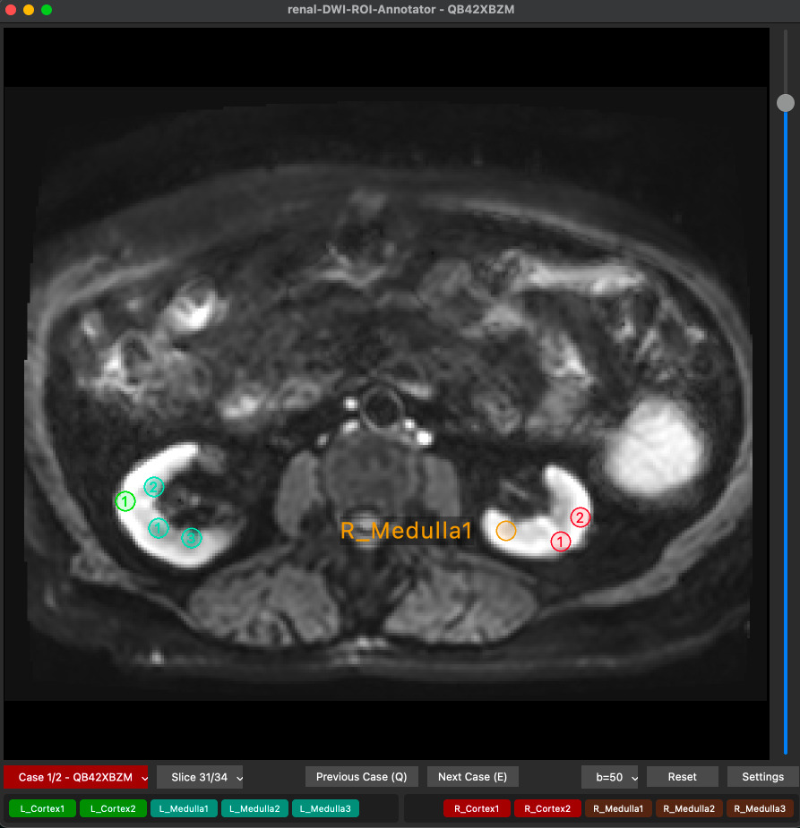

# renal-DWI-ROI-Annotator

ROI annotation tool for renal DWI series.




---

## Features

- **Slice navigation** — mouse wheel, vertical slider, or keyboard
- **Multiple series** — auto-detect all series in a folder, switch with **Previous Case (Q)** / **Next Case (E)** buttons
- **Case / Slice dropdowns** — jump directly to any case or slice via `QToolButton` menus
- **DWI b-value selector** — `QToolButton` menu to choose which b-value to display; **TRACEW** (trace-weighted) series are automatically detected and split into individual b-value groups by parsing the protocol name (e.g. `b0_b200_b1500`)
- **Interactive window/level** — middle‑mouse drag to adjust contrast (width) and brightness (center); **W/L button** shows current values and opens a popup for manual entry and reset to DICOM defaults
- **Per‑case W/L persistence** — window/level settings are saved per series (`roi_masks/windowing.json`) and automatically restored on revisit; when switching to a new case, the W/L carries over from the previous case
- **Flexible folder structure** — supports flat layouts, nested patient/series folders, and organisational intermediate directories; traversed automatically as long as each intermediate level contains a single subdirectory
- **Settings dialog** — configurable ROI count per zone (L/R Cortex/Medulla, 0–10) and default ROI size (diameter/area, Cortex vs Medulla), persisted in `settings.json`
- **ROI placement** — circular stamp following the mouse; click to deposit an ellipse on the image; buttons reflect zone colour when placed (filled = brighter, unfilled = darker)
- **ROI selection & deletion** — click an existing ROI or its button to select it (purple outline, purple name label below, button turns purple); press <kbd>Delete</kbd> or <kbd>Backspace</kbd> to remove it
- **ROI colours** — zone-specific: L_Cortex=green, L_Medulla=turquoise, R_Cortex=red, R_Medulla=orange; unfilled zones are darker, filled are brighter; selection turns purple
- **Dynamic button layout** — ROI buttons are generated from settings, max 5 per row with wrapping, left/right panels aligned; clicking a button jumps to that ROI's slice and selects it
- **NIfTI auto-save** — every ROI placement immediately saves a binary 3D mask (`roi_masks/<label>_r<radius>.nii`) in the patient's folder
- **NIfTI auto-load** — existing masks are automatically restored when opening a series, switching cases, or changing b-value
- **Case completion indicator** — the case dropdown button turns green (complete), red (partial), or gray (no ROIs) based on placement status
- **Exact size preservation** — the original pixel radius is encoded in the filename, ensuring ROIs reload at their exact physical diameter

---

## Project structure

```
renal-DWI-ROI-Annotator/
├── run.py              # Entry point — handles CLI args, launches viewer
├── settings.json       # Configurable constants (colours, layout, ROI defaults)
├── pyproject.toml      # Project metadata & dependencies
├── DATA/               # DICOM datasets
│   ├── <patient>/
│   │   └── roi_masks/  # Generated: 3D NIfTI masks per ROI label
│   │       └── windowing.json  # Per‑case window/level settings (auto‑generated)
│   └── ...
└── src/
    ├── __init__.py     # Makes src/ a Python package
    ├── loader.py       # DICOM discovery, I/O, and DWI b‑value grouping
    └── viewer.py       # DicomViewer class — UI layout, ROI placement & interaction
```

---

## Installation

### 1. Clone or download the repository

```bash
git clone https://github.com/yourusername/renal-DWI-ROI-Annotator.git
cd renal-DWI-ROI-Annotator
```

### 2. Install dependencies

Using **pip** (recommended):

```bash
pip install .
```

Or install manually:

```bash
pip install numpy pydicom PyQt6 nibabel
```

> **Note:** The GUI uses PyQt6 and requires a working display.

---

## Usage

```bash
python run.py                    # opens DATA/ folder
python run.py /path/to/dicom     # opens a custom folder
```

### Controls

| Input | Action |
|---|---|---|
| Mouse wheel up/down | Previous / next slice |
| Vertical slider | Drag to jump to a slice |
| Mouse click (on image) | Place current ROI (stamp cursor) |
| **Middle‑mouse drag** (on image) | Adjust window/level (horizontal = width, vertical = center) |
| Click on existing ROI | Select it |
| <kbd>Delete</kbd> / <kbd>Backspace</kbd> | Delete selected ROI |
| <kbd>Q</kbd> | Previous case |
| <kbd>E</kbd> | Next case |
| <kbd>B</kbd> | Open b-value dropdown |
| **Case / Slice buttons** | Dropdown menu to jump to any case or slice |
| **b-value button** | Dropdown menu to select b-value |
| **W/L button** | Shows current window/level; click to open popup for manual entry and reset |
| **Previous Case / Next Case** buttons | Navigate series |
| **Settings** | Open ROI configuration dialog |

---

## Configuration

Edit `settings.json` or use the **Settings** dialog in the app:

| Key | Default | Description |
|---|---|---|
| `bg_color` | `"#2b2b2b"` | Background colour of the viewer window |
| `default_data_path` | `"DATA"` | Default folder to open (relative to project root) |
| `roi_counts` | `{L_Cortex:2, L_Medulla:3, R_Cortex:2, R_Medulla:3}` | Number of ROIs per zone |
| `cortex_diameter` | `10.0` | Default ROI diameter for Cortex (mm) |
| `medulla_diameter` | `10.0` | Default ROI diameter for Medulla (mm) |

---

## ROI Masks (NIfTI)

Every placed ROI is automatically saved as a binary 3D NIfTI mask in `DATA/<patient>/roi_masks/`. The filename encodes the ROI label and exact pixel radius:

```
L_Cortex1_r3.33.nii   → label L_Cortex1, radius 3.33 px
R_Medulla2_r2.50.nii  → label R_Medulla2, radius 2.50 px
```

Masks are independent of b-value — switching b-values does not clear or reload ROIs. They are restored on launch and case switch. Deleting an ROI removes its mask file. The NIfTI files use the DICOM affine for spatial compatibility with tools like 3D Slicer, FSL, or SPM.

> **Backward compatibility:** Legacy masks using the old `_b<val>` suffix are automatically stripped on load.

---

## License

This project is open source and available under the
[MIT License](https://opensource.org/licenses/MIT).
